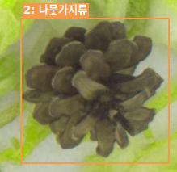
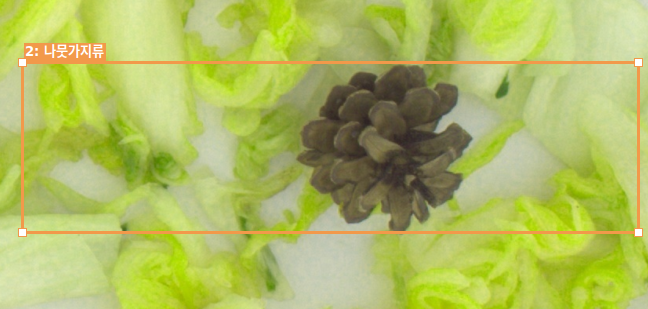
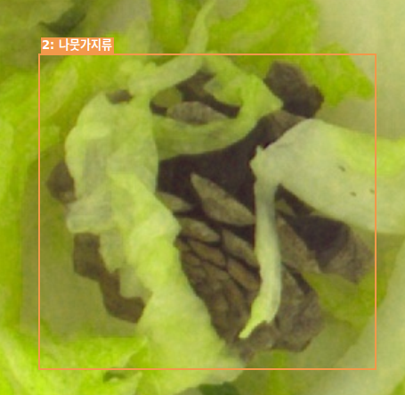

# BBox 기준서 — 바운딩박스 작성 공통 규칙

---

title: BBox 기준서

project: 조각김치 이물검출 라벨링 프로젝트 (교과 7)

type: Standard

status: 초안 (Pilot Test로 검증 예정)

created: 2026-10-02

updated: 2026-10-07

owner: 작성자 이름 적어주세요

---

## 개요

모든 클래스에 공통으로 적용되는 바운딩박스(BBox) 작성 규칙이다.

본 프로젝트의 BBox는 **객체의 실제 외곽선에 밀착하되, 외곽이 잘리지 않도록 2~4px의 최소 여백을 두는 Tight Box를 기본 원칙으로 한다.**

### 핵심 원칙

- 객체 외곽선과 BBox 사이에 **2~4px의 최소 여백을 둔다.**
- 기본 여백은 **2~4px**을 원칙으로 한다.
- 객체의 실제 외곽이 BBox 밖으로 잘리지 않도록 하되, 여백은 4px를 넘기지 않는다.
- 객체와 관계없는 배경이 BBox에 과도하게 포함되지 않도록 한다.
- 하나의 BBox에는 원칙적으로 하나의 객체만 포함한다.
- 판단이 어려운 경우 임의로 처리하지 않고 **REVIEW**로 분류한다.

---

## 1. Tight Box / 여백 기준

### 1-1. 기본 원칙

BBox는 이물질의 **실제 보이는 외곽선에 맞추되, 외곽이 잘리지 않도록 2~4px의 여백을 둔다.**

- 기본 BBox 여유: **2~4px**
- 여백은 2~4px 범위로 통일하며, 1px 이하이거나 5px 이상인 임의의 여백은 추가하지 않는다.
- BBox 내부에 객체와 관계없는 배경이 최소화되도록 한다.
- BBox가 객체 외곽보다 과도하게 바깥으로 나가지 않도록 한다.

### GOOD

객체 외곽과 BBox 사이에 2~4px의 최소 여백만 있는 경우.

### BAD

객체 주변에 4px를 넘는 불필요한 배경 여백이 포함된 경우.

### 주의

BBox 좌표를 지정할 때 단순히 객체 중심을 기준으로 잡거나 객체보다 필요 이상으로 크게 잡지 않는다.

**여백은 2~4px 범위 안에서만 두며, 그 이상의 여유는 두지 않는다.**

단, 이미지 해상도나 객체 외곽이 불명확하여 정확한 경계를 판단하기 어려운 경우에는 임의로 확장하지 않고 REVIEW로 처리한다.

---

## 2. 객체가 이미지 경계에 걸린 경우

이물질의 일부가 이미지 밖으로 잘려 있는 경우에는 **이미지 내부에서 실제로 확인되는 부분만 BBox로 표시한다.**

예:

- 이미지 오른쪽에서 이물질 일부가 잘림
  → 이미지 오른쪽 경계까지 BBox 작성
- 이미지 위쪽에서 이물질 일부가 잘림
  → 이미지 위쪽 경계까지 BBox 작성

이미지 밖에 존재한다고 추정되는 부분까지 BBox를 확장하지 않는다.

이미지 경계 쪽에는 여백을 추가하지 않고 이미지 경계까지만 작성한다. (BBox가 이미지 밖으로 나가지 않는다.)

### 원칙

> **보이는 영역까지만 라벨링한다.**

---

## 3. 객체가 서로 겹친 경우

서로 다른 객체가 겹쳐 있는 경우에도 **각 객체를 구분할 수 있다면 각각 별도의 BBox를 작성한다.**

예:

- 나뭇가지 + 플라스틱 조각
  → 나뭇가지 BBox 1개
  → 플라스틱 조각 BBox 1개

객체 사이의 간격을 임의의 픽셀 기준으로 판단하여 하나로 합치지 않는다.

여백(2~4px) 적용으로 인접한 BBox끼리 일부 겹치더라도 하나로 합치지 않는다.

### 같은 클래스 객체가 붙어 있는 경우

같은 클래스의 객체라도 **실제로 서로 분리된 객체라면 각각 별도의 BBox를 작성한다.**

---

## 4. 객체가 매우 작은 경우

객체의 크기가 작더라도 다음 조건을 만족하면 BBox를 작성한다.

- 실제 이물질로 판단할 수 있음
- Class를 식별할 수 있음
- 검출 대상에 해당함

객체가 점이나 얼룩처럼 보여 **실제 객체인지 판단하기 어려운 경우에는 임의로 BBox를 생성하지 않고 REVIEW로 처리한다.**

### REVIEW 예시

- `too_small_to_identify`
- `object_identification_ambiguous`

---

## 5. 객체 일부가 가려진 경우

다른 객체나 음식물 등에 의해 이물질의 일부가 가려진 경우에도 **Class를 식별할 수 있다면 BBox를 작성한다.**

BBox는 가려진 부분을 추정하여 확장하지 않고 **현재 이미지에서 실제로 확인 가능한 영역을 기준으로 작성한다.**

예:

가려진 영역까지 추정하여 BBox를 확장하지 않는다.

### 판단이 어려운 경우

가려진 정도가 심하여 Class 또는 객체의 경계를 명확하게 판단할 수 없다면:

**Status = REVIEW**

Reason 예:

- `occlusion_ambiguous`
- `object_boundary_ambiguous`

---

## 6. 하나의 객체를 여러 BBox로 나누지 않는다

하나의 실제 객체는 원칙적으로 **하나의 BBox**로 작성한다.

예:

긴 하나의 나뭇가지

→ BBox 1개

객체가 길거나 일부가 다른 물체에 가려져 있더라도 실제로 하나의 객체라면 여러 개의 BBox로 분리하지 않는다.

반대로 서로 떨어져 있는 별개의 객체라면 각각 BBox를 작성한다.

### 판단 기준

**"몇 픽셀 떨어져 있는가"가 아니라 "실제로 하나의 객체인가"를 기준으로 판단한다.**

---

## 7. 판단이 어려운 경우

BBox의 위치나 객체 구분이 애매한 경우 작업자가 임의로 결정하지 않는다.

**Status = REVIEW**

### REVIEW 사유 예시

### REVIEW 사유 코드

- `bbox_boundary_ambiguous`          # 객체의 실제 외곽 경계를 명확하게 판단하기 어려운 경우
- `object_separation_ambiguous`     # 서로 다른 객체인지 하나의 객체인지 구분하기 어려운 경우
- `too_small_to_identify`            # 객체가 너무 작아 실제 이물질 여부 또는 형태를 식별하기 어려운 경우
- `occlusion_ambiguous`              # 다른 객체에 가려져 객체의 형태나 범위를 명확하게 판단하기 어려운 경우
- `class_ambiguous`                  # 객체의 Class를 명확하게 판단하기 어려운 경우
- `object_identification_ambiguous` # 해당 영역이 실제 객체(이물질)인지 여부 자체를 판단하기 어려운 경우

REVIEW 대상은 Issue 기록 탭에 남기고 Reviewer가 최종 판단한다.

---

## 8. BBox 작성 최종 체크리스트

라벨링 완료 전 다음 항목을 확인한다.

- [x] BBox가 객체 외곽에 밀착되어 있고, 객체가 BBox 밖으로 잘리지 않았는가?
- [ ] 객체 주변 여백이 2~4px 범위 안에 있는가?
- [ ] 기본 여백 2~4px이 일관되게 적용되었는가?
- [ ] 객체 외부의 배경이 과도하게 포함되지 않았는가?
- [ ] 하나의 BBox에 서로 다른 객체가 포함되지 않았는가?
- [ ] 하나의 객체를 여러 BBox로 분리하지 않았는가?
- [ ] 이미지 경계를 벗어나도록 추정하여 BBox를 확장하지 않았는가?
- [ ] 가려진 부분을 임의로 추정하여 BBox를 확장하지 않았는가?
- [ ] 실제 객체인지 판단하기 어려운 경우 REVIEW 처리했는가?
- [ ] Class 식별이 어려운 경우 REVIEW 처리했는가?

---

## 9. Pilot Test 검증

본 기준은 **2~4px 여백의 Tight Box**를 기본 기준으로 적용한다.

Pilot Test를 통해 다음 항목을 검증한다.

- 작업자 간 BBox 좌표 편차
- 객체 외곽선 밀착 정도
- 여백(2~4px) 적용의 일관성
- 배경 포함 정도
- 객체 누락 여부
- 동일 객체에 대한 라벨링 일관성
- REVIEW 발생 비율

Pilot Test 결과를 바탕으로 필요한 경우 기준을 수정할 수 있다.

단, 특별한 근거 없이 작업자별로 2~4px 범위를 벗어난 임의의 픽셀 여백을 적용하지 않는다.

---

## 10. 핵심 기준 요약

| 항목 | 기준 |
|---|---|
| 기본 BBox | 객체 외곽에 밀착 (최소 여백 포함) |
| 기본 여백 | **2~4px** |
| 배경 포함 | 최소화 |
| 이미지 밖 객체 | 보이는 영역까지만 (이미지 경계 쪽 여백 없음) |
| 겹친 객체 | 실제 객체별로 판단 |
| 같은 클래스 객체 | 실제 별개 객체면 각각 BBox |
| 하나의 객체 | 원칙적으로 BBox 1개 |
| 작은 객체 | 식별 가능하면 라벨링 |
| 가려진 객체 | 보이는 범위 기준 |
| 판단 어려움 | REVIEW |
| 픽셀 간격 기준 | **사용하지 않음** |
| 임의의 여백 | **2~4px 범위를 벗어난 여백은 사용하지 않음** |

---

## 변경 이력

| 날짜 | 작성자 | 변경 내용 |
|---|---|---|
| 2026-10-02 | 권지현 | 최초 작성 (Google Sheet → md 변환), 여백·겹침 기준 초안 확정 |
| 2026-10-06 | 이유정 강사님 | BBox 기본 여백을 2~4px에서 **0px Tight Box**로 변경, 픽셀 간격 기반 객체 병합 기준 제거 |
| 2026-10-06 | 김도은 | 기존 BBox 기준을 검토하여 0px Tight Box 기준으로 정리하고, 픽셀 간격에 따른 객체 병합 기준을 제거함. REVIEW 사유 코드 및 설명을 보완하고, 참고 문서를 반영하여 최종 기준서로 작성함. |
| 2026-10-07 | 김도은| BBox 기본 여백을 0px에서 **2~4px**로 변경하고, 이미지 경계·인접 객체 처리 문구와 체크리스트, 요약표를 함께 수정함 |
