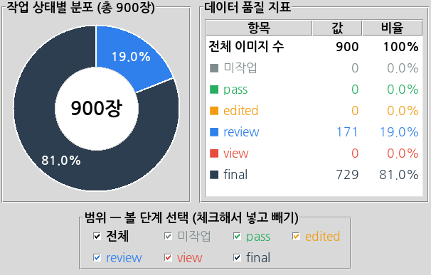

# QA Summary

라벨링이 끝난 900장의 결과가 최종적으로 얼마나 정확하게 정리되었는지 요약하는 품질검사(QA) 결과 문서다.

이 문서는 다음 네 가지에 답한다.

- 전체 900장 중 몇 장을 검사했는가?
- 자동 Validation에서 몇 건의 오류가 발견되었는가?
- 사람이 다시 확인해서 몇 건을 수정했는가?
- 최종적으로 FAIL이나 REVIEW가 남아 있는가?

---

## 1. 전체 데이터

| 항목 | 수량 |
|---|---|
| 전체 이미지 | 900 장 |
| 전체 TXT | 900 개 |
| 라벨 검수 완료 | 900 장 |
| 검사 기준일 | 10/07 |

---

## 2. 자동 Validation 결과

프로그램이 기계적으로 찾을 수 있는 오류를 먼저 검사한다.

검사 항목: #확인필요 

- 이미지와 TXT Pair가 있는가?
- Class ID가 허용 범위(0~6)인가?
- YOLO 좌표가 0~1 범위인가?
- BBox Width / Height가 정상인가?
- 파일 형식이 올바른가?

### 2-1. 판정 결과

| 판정 | 장수 |
|---|---|
| PASS | 900 |
| FAIL | 0 |

### 2-2. 프로그램 Validation 결과 (화면 기준)

| 단계 | 건수 | 의미 |
|---|---|---|
| ERROR | 0 | 수정이 필요한 오류 |
| WARNING | 0 | 확인이 필요한 경고 |
| REVIEW | 0 | 사람이 최종 판단해야 하는 건 |

### 2-3. 발견된 오류

| 오류 종류 | 건수 | 비고 |
|---|---|---|
| Class ID 오류 | 0 | Class 0~6 이외의 값 |
| BBox 이미지 경계 초과 | 0 | |
| Empty TXT 확인 필요 | 0 | 아래 "Empty TXT 처리" 참고 |
| 좌표 형식 오류 | 0 | 0~1 범위 벗어남 등 |
| 이미지-TXT 파일명 불일치 | 0 | |
| 기타 | 0 | |

총 오류: 0 건

### Empty TXT 처리

Empty TXT가 모두 오류는 아니다. 정상 김치처럼 검출 대상 객체가 없는 이미지는 빈 TXT가 정상이다.

| 이미지 확인 결과 | 처리 |
|---|---|
| 검출 대상 없음 | 정상 PASS |
| 검출 대상 있음 | 누락 라벨 → BBox 추가 |

---

## 3. Human QA 결과

자동검사로는 판단하기 어려운 내용을 사람이 이미지와 라벨을 직접 보고 확인한다.

- BBox가 실제 객체에 정확히 맞는가?
- Class가 실제 객체와 맞는가?
- 빠진 객체는 없는가?
- 너무 큰 BBox가 그려져 있지는 않은가?

| 항목 | 건수 |
|---|---|
| 검토 대상 | 900건 |
| 수정 완료 | 40 |
| 미해결 | 229 |

### 수정 내역

| 수정 종류 | 건수 |
|---|---|
| Class 오류 수정 | 5 |
| BBox 오류 수정 | 30 |
| Empty TXT 확인 | 0 |
| 좌표 오류 수정 | 5 |
| Pair 오류 수정 | 0 |

수정 후 재검사 결과: 0

---

## 4. 최종 결과

| 판정 | 장수 |
|---|---|
| PASS | 729 |
| FAIL | 0|
| REVIEW | 171 |

최종 판정: 729(QA 완료 )

### 완료 기준 확인

| 완료 기준 | 목표 | 결과 |
|---|---|---|
| 미처리 REVIEW | 0건 | 171 |
| Validation 오류 | 0건 | 0 |
| 이미지와 TXT Pair | 900 : 900 | 900:900 |
| 전체 검수 | 900장 완료 | 900 |
| FINAL 데이터 정리 | 완료 | 900 |

---

## 참고 문서

- [Project Baseline](project_baseline.md)
- [Class 기준서](class_guide.md)
- [BBox 기준서](bbox_guide.md)

---

## 변경 이력

| 날짜 | 작성자 | 변경 내용 |
|---|---|---|
| 2026-10-08 | 권지현 | QA Summary 양식 작성 |
| 2026-10-08 | 김도은 | QA Summary 양식 작성 |
